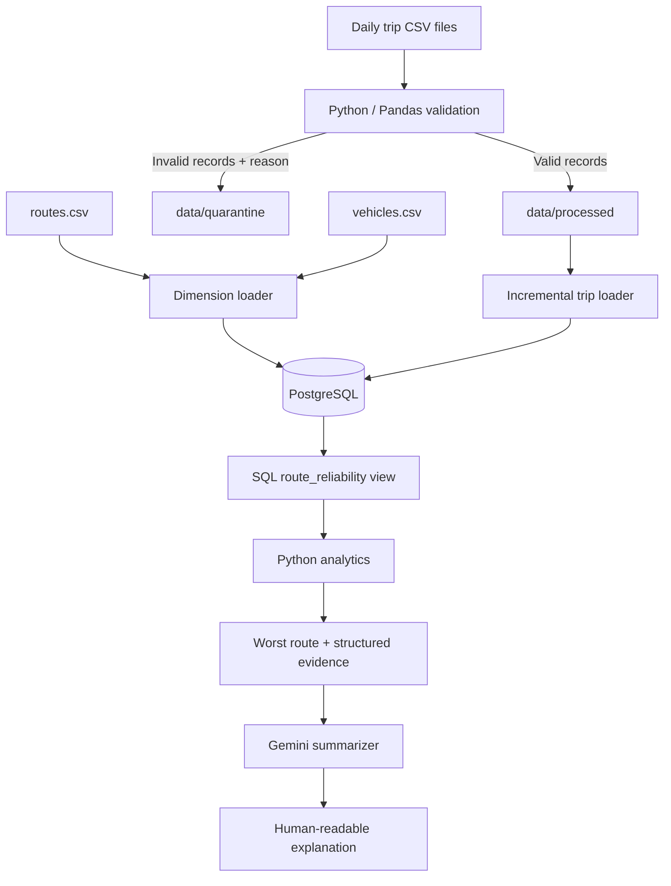

[](https://www.python.org/)
[](https://www.postgresql.org/)
[](https://www.sqlalchemy.org/)
[](https://pandas.pydata.org/)
[](https://ai.google.dev/)
[](https://docs.pytest.org/)
[](LICENSE)

# 🚍 Public Transport Reliability System

A Python + PostgreSQL data-engineering pipeline for processing daily synthetic public-transport trip data, validating records, loading new trips incrementally, calculating route reliability in SQL, and generating a grounded AI explanation of the worst-performing route.

> **Assessment:** DAI-014 — Public Transport Reliability  
> **Data source:** Synthetic CSV batches created for this project.

## Contents

- [Problem Statement](#problem-statement)
- [Key Features](#key-features)
- [Architecture](#architecture)
- [Reliability Metrics](#reliability-metrics)
- [Technology Stack](#technology-stack)
- [Repository Structure](#repository-structure)
- [Dataset](#dataset)
- [Getting Started](#getting-started)
- [Run the Pipeline](#run-the-pipeline)
- [Run Individual Modules](#run-individual-modules)
- [Data Quality and Quarantine](#data-quality-and-quarantine)
- [Testing](#testing)
- [Design Decisions and Limitations](#design-decisions-and-limitations)
- [Security](#security)

## Problem Statement

Public-transport operators need to identify routes with poor service reliability and understand the evidence behind that assessment. This project processes daily trip records and calculates route-level measures such as average delay, on-time rate, cancellation rate, maximum delay, and a composite reliability score.

The project demonstrates core data-engineering practices:

1. Validate source records before they enter analytical tables.
2. Separate invalid rows into quarantine files with validation reasons.
3. Process daily batches incrementally and guard against duplicate trip IDs.
4. Calculate metrics deterministically in SQL.
5. Use AI to explain SQL-generated evidence rather than asking the model to calculate metrics.

## Key Features

- **Daily batch input:** date-specific trip CSVs under `data/raw/`.
- **Validation and cleaning:** checks required fields, route/vehicle references, status values, numeric fields, capacity, timestamps, and duplicate IDs.
- **Quarantine:** rejected records are written separately with a `validation_error` reason.
- **Relational storage:** PostgreSQL tables for routes, vehicles, trips, and pipeline state.
- **Incremental loading:** records the latest processed service date in `pipeline_state`.
- **Duplicate protection:** `trip_id` is the primary key and the loader uses `ON CONFLICT (trip_id) DO NOTHING`.
- **SQL analytics:** the `route_reliability` view calculates route-level metrics and a reliability score.
- **Grounded AI explanation:** Gemini receives structured evidence from SQL; it does not determine the worst route or calculate the metrics.
- **Automated tests:** Pytest tests validation and selected edge cases.

## Architecture



### Main components

| Component | Responsibility |
|---|---|
| `src/db.py` | Creates the SQLAlchemy PostgreSQL engine and checks connectivity. |
| `src/ingestion/load_dimensions.py` | Inserts or updates route and vehicle reference data. |
| `src/validation/validator.py` | Validates daily files and writes clean and quarantined outputs. |
| `src/ingestion/load_trips.py` | Loads validated records incrementally and updates the date watermark. |
| `sql/schema.sql` | Defines database tables and constraints. |
| `sql/route_reliability_view.sql` | Defines route-level analytical metrics. |
| `src/analytics/metrics.py` | Reads route metrics and retrieves the lowest-scoring route. |
| `src/ai/summarizer.py` | Calls the configured Gemini model with structured evidence. |
| `src/pipeline.py` | Orchestrates the end-to-end workflow. |

## Reliability Metrics

The PostgreSQL view calculates these measures per route:

- **Total trips:** all trips recorded for the route.
- **Completed trips:** trips where `status = 'completed'`.
- **Cancelled trips:** trips where `status = 'cancelled'`.
- **On-time trips:** completed trips where `delay_minutes <= 5`.
- **Delayed trips:** completed trips where `delay_minutes > 5`.
- **Average delay:** average delay among completed trips.
- **Maximum delay:** maximum recorded delay among completed trips.
- **On-time rate:** on-time trips divided by completed trips, multiplied by 100.
- **Cancellation rate:** cancelled trips divided by total trips, multiplied by 100.

The composite reliability score is:

\[
\text{Reliability Score}
= 0.60 \times \text{On-time Rate}
+ 0.40 \times (100 - \text{Cancellation Rate})
\]

The two rates are percentages, so the score is on a 0–100 scale; a higher score indicates better reliability. The 60/40 weighting is a transparent project design choice, not an industry standard. SQL is the source of truth for the metric values.

## Technology Stack

| Layer | Technology | Purpose |
|---|---|---|
| Language | Python 3.11+ | Ingestion, validation, orchestration, AI integration |
| Data processing | Pandas | CSV reading, type conversion, validation, staging |
| Database | PostgreSQL 14+ | Relational storage, constraints, analytical view |
| Database connection | SQLAlchemy + psycopg2 | Connections, transactions, parameterized SQL |
| Configuration | python-dotenv | Local environment variables |
| AI | Google Gemini via `google-genai` | Natural-language explanation from SQL evidence |
| Testing | Pytest | Automated validation and edge-case tests |
| Version control | Git | Reviewable development history |

## Repository Structure

```text
public-transport-reliability/
├── data/
│   ├── raw/                  # Daily source CSV files
│   ├── dimensions/           # routes.csv and vehicles.csv
│   ├── processed/            # Generated validated CSV files
│   ├── quarantine/           # Edge-case fixture and rejected records
│   └── test_input/            # Test input fixtures, if used by tests
├── docs/
│   ├── architecture.md
│   └── design_decisions.md
├── sql/
│   ├── schema.sql
│   ├── metrics.sql
│   └── route_reliability_view.sql
├── src/
│   ├── __init__.py
│   ├── db.py
│   ├── pipeline.py
│   ├── ingestion/
│   │   ├── load_dimensions.py
│   │   ├── load_trips.py
│   │   └── create_next_day.py
│   ├── validation/
│   │   └── validator.py
│   ├── analytics/
│   │   └── metrics.py
│   └── ai/
│       ├── summarizer.py
│       └── run_summary.py
├── tests/
│   ├── test_validation.py
│   └── test_edge_cases.py
├── .env.example
├── .gitignore
├── requirements.txt
└── README.md
```

`data/processed/` and generated files such as `data/quarantine/invalid_*.csv` are runtime outputs and can be regenerated. Commit the original source CSVs, dimension files, and fixtures needed to reproduce the project; do not commit generated outputs unnecessarily.

## Dataset

The dataset is synthetic and designed to exercise daily batch ingestion and validation.

| Item | Contents |
|---|---|
| Date range | 1–30 September 2026 |
| Daily source files | 30 |
| Normal trips | 180 per day |
| Raw source rows | 5,405, including five duplicate copies |
| Unique valid trips after validation | 5,400 |
| Routes | 10 |
| Vehicles | 30 |
| Duplicate example | Five duplicate copies in the 15 September file |

Main trip columns include `trip_id`, `service_date`, `route_id`, `scheduled_departure`, `scheduled_arrival`, `actual_departure`, `actual_arrival`, `delay_minutes`, `status`, `vehicle_id`, `passenger_count`, `weather_condition`, `traffic_level`, and `event_type`.

The daily CSVs under `data/raw/` are the primary ingestion source. If `master_trips_clean.csv` is present, it is a reference artifact and is not the main input for incremental loading.

## Getting Started

### Prerequisites

- Python 3.11 or newer
- PostgreSQL 14 or newer, installed and running or reachable
- Git
- A Gemini API key for the AI-summary stage

### 1. Clone the repository

Replace the URL if your GitHub repository uses a different location.

```bash
git clone https://github.com/deveshsharma27/public-transport-reliability.git
cd public-transport-reliability
```

### 2. Create and activate a virtual environment

**Windows PowerShell**

```powershell
python -m venv venv
.\venv\Scripts\Activate.ps1
```

**Linux/macOS**

```bash
python3 -m venv venv
source venv/bin/activate
```

### 3. Install dependencies

```bash
python -m pip install -r requirements.txt
```

### 4. Configure environment variables

Copy `.env.example` to `.env`.

**Windows PowerShell**

```powershell
Copy-Item .env.example .env
```

**Linux/macOS**

```bash
cp .env.example .env
```

Update `.env` with your local PostgreSQL credentials and Gemini key:

```dotenv
DB_HOST=localhost
DB_PORT=5432
DB_NAME=public_transport
DB_USER=postgres
DB_PASSWORD=your_postgres_password

GEMINI_API_KEY=your_gemini_api_key
AI_MODEL=gemini-3.8-flash
```

Use a model name available to your Gemini API account. Keep real credentials in `.env`, not in source code or Git history.

### 5. Create the PostgreSQL database

Create the database once in pgAdmin or with `psql`:

```sql
CREATE DATABASE public_transport;
```

Connect to `public_transport` and execute the schema:

```bash
psql -U postgres -d public_transport -f sql/schema.sql
```

Create the analytical view:

```bash
psql -U postgres -d public_transport -f sql/route_reliability_view.sql
```

`sql/metrics.sql` is available for standalone SQL analysis.

### 6. Test the database connection

```bash
python -m src.db
```

Expected output:

```text
PostgreSQL connection successful: 1
```

Before running the full pipeline, verify that `data/raw/` contains the daily trip files and `data/dimensions/` contains `routes.csv` and `vehicles.csv`.

## Run the Pipeline

Run the full workflow from the repository root:

```bash
python -m src.pipeline
```

The orchestrator:

1. Creates/checks the PostgreSQL connection.
2. Synchronizes route and vehicle dimensions.
3. Validates raw daily files and writes clean/quarantined outputs.
4. Loads validated trips incrementally.
5. Queries the SQL reliability view and selects the lowest-scoring route.
6. Sends the structured evidence to the AI summarizer.

The first run processes the available daily files. Subsequent runs skip files whose service date is at or before the saved `last_processed_date`. The primary key on `trip_id` provides an additional safeguard against duplicate insertion.

The database and SQL stages can be run independently while troubleshooting. A successful AI summary also requires valid Gemini credentials and an available configured model.

## Run Individual Modules

Run these commands from the project root with the virtual environment activated.

**Check PostgreSQL connectivity**

```bash
python -m src.db
```

**Synchronize route and vehicle dimensions**

```bash
python -m src.ingestion.load_dimensions
```

**Validate the daily trip files**

```bash
python -m src.validation.validator
```

**Load validated trips incrementally**

```bash
python -m src.ingestion.load_trips
```

**Display route metrics and worst-route evidence**

```bash
python -m src.analytics.metrics
```

**Generate the AI summary**

```bash
python -m src.ai.run_summary
```

**Generate a synthetic next-day batch for incremental-load testing**

```bash
python -m src.ingestion.create_next_day
```

Use the next-day generator only for a deliberate incremental-load demonstration. It adds another synthetic batch; loading it will change database counts and analytics.

## Data Quality and Quarantine

Validation happens before trip records enter the PostgreSQL `trips` table. Checks include:

| Category | Example condition | Handling |
|---|---|---|
| Required fields | Missing `trip_id`, `route_id`, service date, status, or other required field | Quarantine |
| Referential integrity | Route or vehicle ID is not present in the reference data | Quarantine |
| Allowed values | Status is not `completed` or `cancelled` | Quarantine |
| Numeric values | Negative delay or negative passenger count | Quarantine |
| Capacity | Passenger count exceeds the referenced vehicle capacity | Quarantine |
| Scheduled times | Scheduled arrival is before scheduled departure | Quarantine |
| Actual times | Completed trip has missing actual timestamps or arrival precedes departure | Quarantine |
| Cancellation consistency | Cancelled trip has actual departure/arrival timestamps | Quarantine |
| Duplicate IDs | `trip_id` repeats within the same daily file | Keep first occurrence; quarantine later copies |

Valid rows are written to `data/processed/clean_*.csv`. Rejected rows are written to `data/quarantine/invalid_*.csv` and include a `validation_error` field. Raw input files remain unchanged.

## Testing

Run the test suite from the repository root:

```bash
python -m pytest -v
```

On Windows, `python -m pytest -v` is recommended if the standalone `pytest` command does not resolve the repository root on the import path.

The tests cover validation of valid data, duplicate handling, invalid numeric values, missing route IDs, and selected edge cases. Run the tests in your environment and report the actual result; do not assume a pass count before execution.

## Design Decisions and Limitations

- **Python + SQL separation:** Python handles ingestion, validation, orchestration, and AI integration. PostgreSQL stores the data and calculates the analytics.
- **Synthetic data:** the results demonstrate system behavior and do not describe actual public-transport operations.
- **Date watermark:** the current loader skips files with dates at or before the latest processed date. Late-arriving changes to an older service date require a deliberate backfill/reprocessing strategy; the watermark alone does not detect changed historical files.
- **Reliability formula:** the 60/40 weighting is a documented project choice and may be changed if a business owner defines a different priority.
- **AI output:** the language model's wording can vary. SQL values are authoritative; the AI narrative is explanatory.
- **No causal claim:** the dataset includes weather, traffic, and event fields, but this project does not prove that any factor caused delays.
- **No live feed:** the current pipeline reads synthetic CSV batches and does not connect to a live transit API.

## Security

- Keep `.env` out of version control.
- Commit `.env.example` with placeholders only.
- Do not put API keys or database passwords in source code, sample data, screenshots, or commit messages.
- If a credential is pushed to a remote repository, revoke or rotate it; removing it in a later commit does not remove it from Git history.

## Documentation

- [System architecture](docs/architecture.md)
- [Design decisions](docs/design_decisions.md)
- Database schema: `sql/schema.sql`
- Reliability query: `sql/metrics.sql`
- Analytical view: `sql/route_reliability_view.sql`

---

Built for a data-engineering technical assessment using synthetic data.
