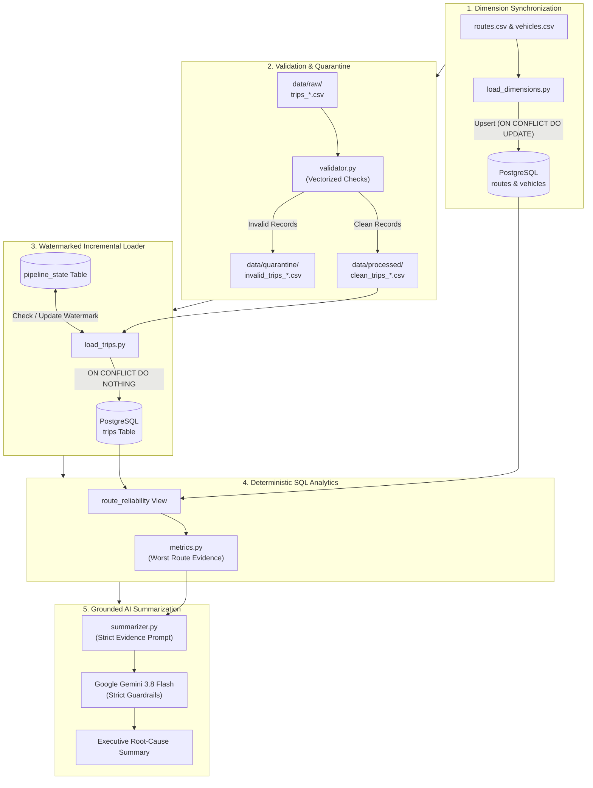

# 🚍 Public Transport Reliability System

[](https://www.python.org/)
[](https://www.postgresql.org/)
[](https://www.sqlalchemy.org/)
[](https://pandas.pydata.org/)
[](https://ai.google.dev/)
[](https://docs.pytest.org/)
[](LICENSE)

An enterprise-grade, batch-oriented data engineering and analytics pipeline built with **Python**, **PostgreSQL**, and **Google Gemini**. The system processes daily public transit trip datasets, enforces multi-stage data validation and anomaly quarantine, executes watermarked incremental loading, calculates deterministic route reliability scores in SQL, and generates grounded, hallucination-free executive summaries.

---

## 📑 Table of Contents

- [Overview & Problem Statement](#-overview--problem-statement)
- [Key Features](#-key-features)
- [System Architecture](#-system-architecture)
- [Reliability Scoring Methodology](#-reliability-scoring-methodology)
- [Tech Stack](#-tech-stack)
- [Repository Structure](#-repository-structure)
- [Getting Started](#-getting-started)
  - [Prerequisites](#prerequisites)
  - [Installation & Virtual Environment](#installation--virtual-environment)
  - [Environment Configuration](#environment-configuration)
  - [Database Initialization](#database-initialization)
- [Running the System](#-running-the-system)
  - [Full End-to-End Pipeline](#full-end-to-end-pipeline)
  - [Running Individual Modules](#running-individual-modules)
- [Data Quality & Quarantine Framework](#-data-quality--quarantine-framework)
- [Testing & Quality Assurance](#-testing--quality-assurance)
- [Documentation & Deep Dives](#-documentation--deep-dives)
- [License](#-license)

---

## 🎯 Overview & Problem Statement

Public transit networks generate thousands of daily trip events containing GPS tracking, schedule compliance, and passenger telemetry. Real-world operational data frequently contains sensor noise, missing values, corrupt timestamps, inverted travel times, capacity violations, and duplicate records.

Transit management teams require:
1. **Strict Data Ingestion**: Filtering corrupted telemetry before database contamination without silent data loss.
2. **Idempotent Incremental Processing**: Handling daily batch deliveries without duplicating previously ingested service days.
3. **Auditable Metric Calculation**: Evaluating on-time performance and service cancellation rates deterministically in SQL.
4. **Grounded AI Root-Cause Narratives**: Translating complex numerical evidence into clear executive summaries without generative hallucinations.

This project delivers a complete, production-ready solution satisfying these requirements.

---

## ✨ Key Features

- **🛡️ Vectorized Data Quality & Quarantine**: Evaluates 12+ schema, referential, temporal, and numeric checks in Pandas. Corrupted records are quarantined with discrete error tags; valid records are cleanly staged.
- **🔄 Watermarked Incremental Ingestion**: Uses a `pipeline_state` table to record the latest processed date. Automatically skips previously ingested dates and uses `ON CONFLICT (trip_id) DO NOTHING` for rerun idempotency.
- **📐 Pure SQL Analytics View**: Implements a dedicated `route_reliability` PostgreSQL view computing on-time rates, cancellation rates, delay distributions, and composite scores.
- **🤖 Grounded AI Explanations**: Integrates Google Gemini (`gemini-3.8-flash`) via the modern `google-genai` SDK. AI operates strictly under prompt containment using SQL-calculated evidence—**zero arithmetic done by the LLM, eliminating hallucination risk**.
- **🧩 Decoupled Modular Architecture**: Run the pipeline end-to-end or execute individual stages (dimension sync, validation, incremental loader, analytics, AI summary) as standalone scripts.

---

## 🏗️ System Architecture



---

## 📊 Reliability Scoring Methodology

The route reliability score is computed purely within PostgreSQL using a weighted composite formula:

$$\text{Reliability Score} = 0.60 \times \left( \frac{\text{On-Time Trips}}{\text{Completed Trips}} \times 100 \right) + 0.40 \times \left( 100 - \frac{\text{Cancelled Trips}}{\text{Total Trips}} \times 100 \right)$$

### Formulation Rationale
| Component | Weight | Operational Purpose |
|:---|:---:|:---|
| **On-Time Rate** | **60%** | Measures schedule adherence for completed runs (trips where $\text{delay} \le 5\text{ minutes}$). High delay directly erodes passenger trust. |
| **Non-Cancellation Rate** | **40%** | Heavily penalizes cancelled services ($100 - \text{Cancellation Rate}$), reflecting the severe passenger disruption caused by unserved trips. |

- **Score Range**: Scaled from **0.0 to 100.0** (higher is better).
- **Zero-Division Safeguards**: Implements `NULLIF(completed_trips, 0)` and `NULLIF(total_trips, 0)` to handle routes with no completed or scheduled trips without SQL exceptions.

---

## 🛠️ Tech Stack

| Layer | Technology | Purpose |
|:---|:---|:---|
| **Language** | Python 3.14+ | Ingestion orchestration, data validation, and AI integration |
| **Database** | PostgreSQL 15+ | Relational data warehouse, table constraints, analytical view |
| **ORM / Driver** | SQLAlchemy 2.0+ & psycopg2 | Database connection pooling, parameterization, and transactions |
| **Data Processing** | Pandas 3.0+ | Vectorized multi-column validation and batch transformation |
| **Generative AI** | Google Gemini 3.8 Flash (`google-genai`) | Natural language root-cause summary from SQL evidence |
| **Testing** | Pytest 9.0+ | Automated test assertions on edge cases and validation rules |
| **Configuration** | Python-dotenv | Secure environment variable management |

---

## 📁 Repository Structure

```
public-transport-reliability/
├── .env.example                  # Environment variable configuration template
├── .gitignore                    # Git tracking ignore rules
├── README.md                     # Project documentation and user guide
├── requirements.txt              # Pinned Python package dependencies
├── data/
│   ├── dimensions/               # Dimension reference datasets
│   │   ├── routes.csv            # Route IDs, names, endpoints, distances, travel times
│   │   └── vehicles.csv          # Vehicle IDs, types, and passenger capacities
│   ├── raw/                      # Raw daily trip event CSVs (trips_2026_09_01..30.csv)
│   ├── processed/                # Validated clean CSVs ready for database loading
│   ├── quarantine/               # Rejected records flagged with validation_error tags
│   └── test_input/               # Test fixtures and simulated edge-case inputs
├── docs/
│   ├── architecture.md           # Comprehensive architectural specifications & diagrams
│   └── design_decisions.md       # Architectural Decision Records (ADRs)
├── sql/
│   ├── schema.sql                # Table definitions (routes, vehicles, trips, pipeline_state)
│   ├── route_reliability_view.sql# Analytical view computing route reliability metrics
│   └── metrics.sql               # Standalone SQL query for ad-hoc reliability reporting
├── src/
│   ├── __init__.py
│   ├── db.py                     # SQLAlchemy database engine and connection testing
│   ├── pipeline.py               # Master end-to-end pipeline orchestrator (Stages 1-6)
│   ├── ai/
│   │   ├── __init__.py
│   │   ├── run_summary.py        # Isolated CLI runner for the AI summary stage
│   │   └── summarizer.py         # Gemini API client with strict anti-hallucination prompt
│   ├── analytics/
│   │   ├── __init__.py
│   │   └── metrics.py            # Analytics queries, metric formatting, worst route extractor
│   ├── ingestion/
│   │   ├── __init__.py
│   │   ├── create_next_day.py    # Synthetic next-day generator for incremental testing
│   │   ├── load_dimensions.py    # Upsert loader for routes and vehicles dimensions
│   │   └── load_trips.py         # Watermarked incremental trip loader
│   └── validation/
│       ├── __init__.py
│       └── validator.py          # Vectorized Pandas validation engine & quarantine routing
└── tests/
    ├── __init__.py
    ├── test_edge_cases.py        # Unit tests validating rejection of corrupt edge-case files
    └── test_validation.py        # Unit tests verifying specific validation rules
```

---

## 🚀 Getting Started

### Prerequisites

- **Python**: Version 3.11 or higher (tested up to Python 3.14)
- **PostgreSQL**: Version 14 or higher installed and running
- **Gemini API Key**: Free tier or paid key from [Google AI Studio](https://aistudio.google.com/)

### Installation & Virtual Environment

1. **Clone the repository**:
   ```bash
   git clone https://github.com/deveshsharma27/public-transport-reliability.git
   cd public-transport-reliability
   ```

2. **Create and activate a virtual environment**:
   - **Windows (PowerShell)**:
     ```powershell
     python -m venv venv
     .\venv\Scripts\Activate.ps1
     ```
   - **Linux / macOS**:
     ```bash
     python3 -m venv venv
     source venv/bin/activate
     ```

3. **Install dependencies**:
   ```bash
   pip install -r requirements.txt
   ```

### Environment Configuration

Create a `.env` file in the project root directory by copying `.env.example`:

```bash
cp .env.example .env
```

Configure your credentials inside `.env`:

```ini
DB_HOST=localhost
DB_PORT=5432
DB_NAME=public_transport
DB_USER=postgres
DB_PASSWORD=your_secure_password

# Google Gemini API key
GEMINI_API_KEY=your_gemini_api_key

# Optional: configure model override (defaults to gemini-3.8-flash)
AI_MODEL=gemini-3.8-flash
```

### Database Initialization

1. Create the database in PostgreSQL:
   ```sql
   CREATE DATABASE public_transport;
   ```

2. Execute the schema DDL and analytical view:
   ```bash
   # Using psql:
   psql -U postgres -d public_transport -f sql/schema.sql
   psql -U postgres -d public_transport -f sql/route_reliability_view.sql
   ```

3. Test database connectivity:
   ```bash
   python -m src.db
   ```
   *Expected output: `PostgreSQL connection successful: 1`*

---

## ⚡ Running the System

### Full End-to-End Pipeline

Execute the master orchestrator to run all six stages in sequence:

```bash
python -m src.pipeline
```

#### Pipeline Console Output
```text
======================================================================
PUBLIC TRANSPORT RELIABILITY PIPELINE
======================================================================

[1/6] PostgreSQL connection ready.

[2/6] Synchronizing dimensions...
Routes synchronized: 10
Vehicles synchronized: 20

[3/6] Validating daily trip data...
trips_2026_09_01.csv: 180 valid, 0 invalid
...
Validation completed.
Total valid records: 5395
Total invalid records: 5

[4/6] Loading validated trips incrementally...
Last processed date: None
LOADED clean_trips_2026_09_01.csv | Inserted: 180 | Skipped duplicates: 0
...
Incremental loading completed.

[5/6] Calculating route reliability metrics...
Worst route: R07 - Uptown - Tech Park
Reliability score: 68.42

[6/6] Generating AI summary...

AI SUMMARY
----------------------------------------------------------------------
Route R07 (Uptown - Tech Park) is the worst-performing route with a
reliability score of 68.42. Out of 540 total trips, 45 were cancelled
(cancellation rate of 8.33%). Among the 495 completed trips, only 312
ran on time (on-time rate of 63.03%), with an average delay of 18.4
minutes and a peak delay of 74 minutes.

======================================================================
PIPELINE COMPLETED SUCCESSFULLY
======================================================================
```

### Running Individual Modules

Each module is decoupled and can be invoked independently:

- **Dimension Synchronization**:
  ```bash
  python -m src.ingestion.load_dimensions
  ```
- **File Validation & Quarantine**:
  ```bash
  python -m src.validation.validator
  ```
- **Incremental Trip Ingestion**:
  ```bash
  python -m src.ingestion.load_trips
  ```
- **Display Route Reliability Metrics Table**:
  ```bash
  python -m src.analytics.metrics
  ```
- **Standalone AI Summary Generation**:
  ```bash
  python -m src.ai.run_summary
  ```
- **Generate Synthetic Next-Day Batch (For Incremental Ingestion Testing)**:
  ```bash
  python -m src.ingestion.create_next_day
  ```

---

## 🧪 Data Quality & Quarantine Framework

Validation is executed before records reach PostgreSQL. The pipeline enforces 12 distinct validation rules:

| Category | Rule Code | Condition / Failure Trigger | Action |
|:---|:---|:---|:---|
| **Mandatory** | `missing_<field>` | Empty or null value in required columns | Quarantined |
| **Referential** | `invalid_route_id` | `route_id` missing from `routes.csv` | Quarantined |
| **Referential** | `invalid_vehicle_id` | `vehicle_id` missing from `vehicles.csv` | Quarantined |
| **Domain** | `invalid_status` | Status not in `('completed', 'cancelled')` | Quarantined |
| **Numeric** | `negative_passenger_count` | `passenger_count < 0` | Quarantined |
| **Numeric** | `passenger_count_exceeds_capacity` | `passenger_count > vehicle.capacity` | Quarantined |
| **Numeric** | `negative_delay` | `delay_minutes < 0` | Quarantined |
| **Temporal** | `scheduled_arrival_before_departure` | `scheduled_arrival < scheduled_departure` | Quarantined |
| **Telemetry** | `completed_trip_missing_actual_departure` | `completed` trip without departure timestamp | Quarantined |
| **Telemetry** | `completed_trip_missing_actual_arrival` | `completed` trip without arrival timestamp | Quarantined |
| **Temporal** | `actual_arrival_before_departure` | `actual_arrival < actual_departure` | Quarantined |
| **Telemetry** | `cancelled_trip_has_actual_departure` | `cancelled` trip with departure timestamp | Quarantined |
| **Telemetry** | `cancelled_trip_has_actual_arrival` | `cancelled` trip with arrival timestamp | Quarantined |
| **Uniqueness** | `duplicate_trip_id_in_file` | Repeated `trip_id` in same batch | Quarantined |

Quarantined files are saved as `data/quarantine/invalid_trips_<date>.csv` with a `validation_error` column detailing the specific failure.

---

## 🔬 Testing & Quality Assurance

The project includes unit tests covering validation rules and edge cases:

Run test suite using pytest:
```bash
pytest
```

Run test suite with verbose output:
```bash
pytest -v
```

---

## 📚 Documentation & Deep Dives

For in-depth architectural and system design documentation, refer to:
- 📖 [**System Architecture (`docs/architecture.md`)**](docs/architecture.md): Subsystems, sequence diagrams, state machines, and resilience strategies.
- 📐 [**System Design (`docs/design.md`)**](docs/design.md): Entity-relationship diagrams, validation mechanics, mathematical formulation, and trade-offs.
- ⚖️ [**Design Decisions (`docs/design_decisions.md`)**](docs/design_decisions.md): Architectural Decision Records (ADRs) explaining core technology and pattern selections.

---

## 📄 License

This project is licensed under the [MIT License](LICENSE).