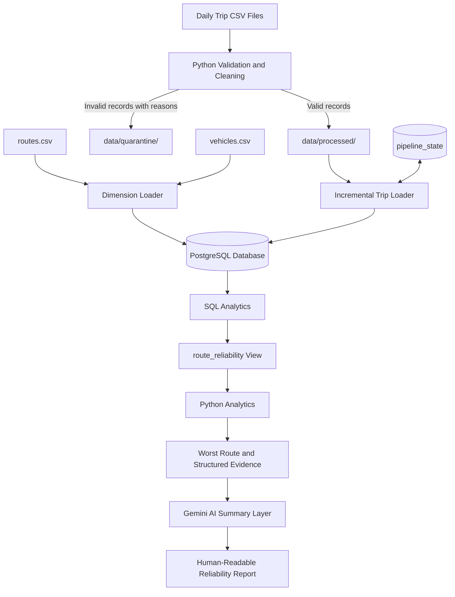

## 🏗️ System Architecture

### Overview

The Public Transport Reliability system processes daily synthetic trip data using Python and PostgreSQL. It validates incoming records, quarantines invalid data, incrementally loads valid records, calculates route-level reliability metrics using SQL, and generates an AI summary based on the calculated evidence.

### Architecture Diagram

### Architecture Components

| Component | Responsibility |
|---|---|
| **1. Source Data** | Provides daily CSV files containing scheduled trips, actual times, delays, cancellations, traffic, and weather information. |
| **2. Validation and Cleaning** | Uses Python and Pandas to validate records, detect invalid values, and separate valid records from rejected records. |
| **3. Quarantine** | Stores rejected records with a `validation_error` field explaining why each record failed validation. |
| **4. Dimension Loading** | Loads route and vehicle reference data into PostgreSQL before trip records are loaded. |
| **5. Incremental Trip Loader** | Processes validated daily files, tracks the latest processed service date, and prevents duplicate trip insertion. |
| **6. PostgreSQL Database** | Stores route metadata, vehicle metadata, trip records, and pipeline processing state. |
| **7. SQL Analytics** | Calculates route-level metrics through the `route_reliability` view. |
| **8. Python Analytics** | Retrieves the route metrics and selects the worst-performing route with its supporting evidence. |
| **9. AI Summary Layer** | Uses Google Gemini to explain the SQL-generated evidence in natural language. |

### Data Flow

1. **Ingestion:** Python reads the source CSV files.
2. **Validation:** Records are checked before they proceed to database loading.
3. **Separation:** Valid records are written to `data/processed/`; invalid records are written to `data/quarantine/`.
4. **Database loading:** Route and vehicle dimensions are synchronized, and valid trips are loaded incrementally into PostgreSQL.
5. **Analytics:** SQL calculates delays, on-time rates, cancellation rates, and reliability scores.
6. **Worst-route identification:** Python retrieves the lowest-scoring route and its calculated metrics.
7. **AI explanation:** Gemini generates a human-readable summary using the structured evidence.

### Design Principle

**SQL is the source of truth for analytical results.** Python handles ingestion, validation, orchestration, and evidence retrieval, while AI explains the calculated results rather than independently calculating metrics or selecting the worst-performing route.